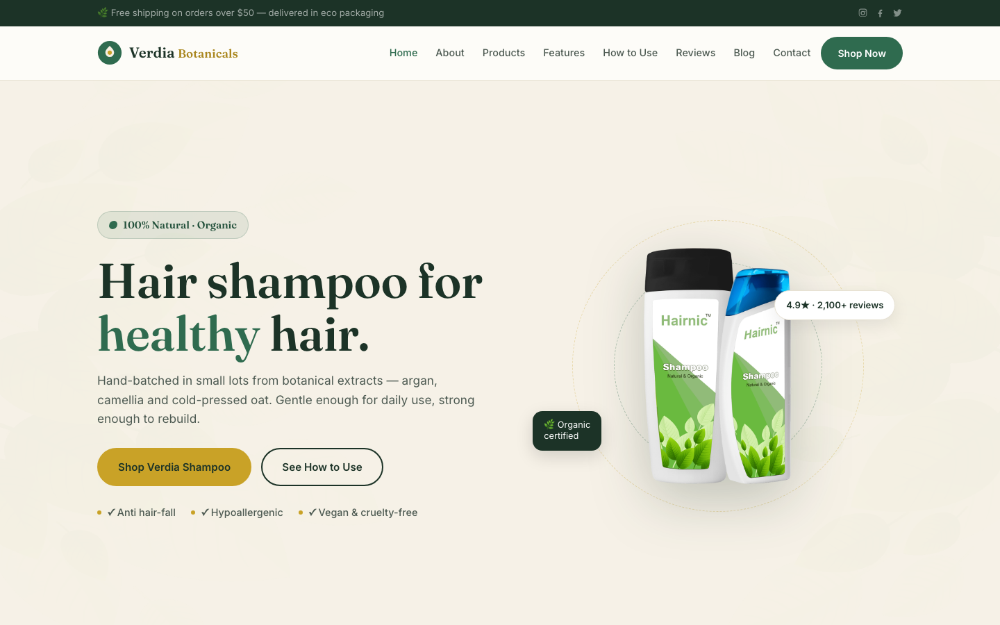

# Verdia Botanicals — Natural Shampoo Single-Product Template

A premium, framework-free HTML template for a single-product natural hair-care brand. Forest green, cream and gold on a soft botanical ground, driven by Fraunces display type and Inter body text — a calm, credible presence for a small-batch shampoo brewed from 12 botanical extracts in Portland, Oregon.

## 📸 Screenshot

## Design System

| Token | Value |
|-------|-------|
| **Ground** | `--clr-bg` `#fdfcf8` (cream white), `--clr-bg-alt` `#f6f1e7` (sand), `--clr-dark` `#1c3327` (forest) |
| **Primary** | `--clr-primary` `#2f6b4f` (forest green), `--clr-primary-deep` `#23513b` |
| **Accent** | `--clr-accent` `#c9a227` (gold), `--clr-accent-deep` `#a9861d` |
| **Text** | `--clr-ink` `#1c3327`, `--clr-text` `#4d5a52`, `--clr-text-light` `#7a867d` |
| **Display type** | `Fraunces` (serif, 400–700) |
| **Body type** | `Inter` (sans, 400–700) |
| **Container** | 1200px max-width, centered |
| **Breakpoints** | ~992px (grid collapse), ~768px (mobile nav), ~576px (single column) |

## Pages

| Page | File | Description |
|------|------|-------------|
| Home | [index.html](index.html) | Hero product shot with rotating halo rings, USP strip, six benefit cards, story split, three-step wash ritual, product grid, testimonials, blog preview, newsletter |
| About | [about.html](about.html) | Brand story split, stats band, values grid |
| Products | [product.html](product.html) | Signature formula detail with specs + price row, full product grid |
| Features | [feature.html](feature.html) | Six benefit promises, formula "what's in / what's not" dark split |
| How to Use | [how-to-use.html](how-to-use.html) | Three-step wash ritual, wash-day habits split |
| Reviews | [testimonial.html](testimonial.html) | Six verified testimonials with photo avatars, stats band |
| Blog | [blog.html](blog.html) | Six hair-science journal posts |
| Contact | [contact.html](contact.html) | Contact form with `[data-form]` validation, info cards, map |
| 404 | [404.html](404.html) | On-brand error page with recovery links |

## Features

- **Framework-free** — pure HTML5, CSS3 (custom properties, Grid, Flexbox, `clamp()`), vanilla JavaScript
- **Botanical-shop aesthetic** — forest green + gold on cream, editorial serif display type
- **Fluid responsive** — three breakpoints, no horizontal scroll on any viewport
- **Scroll reveal** — IntersectionObserver-powered `.reveal` animations (respects `prefers-reduced-motion`)
- **Mobile nav** — burger toggle with `aria-expanded` accessible pattern
- **Hero product presentation** — bottle cutout with dashed rotating halo rings, floating rating pill and organic badge
- **Product cards** — media, badge, price and add-to-cart action pattern
- **Ritual steps** — numbered three-stage wash routine on dark ground
- **Testimonials** — real portrait avatars with star ratings
- **Newsletter form** — footer CTA with `[data-form]` validation
- **Contact form** — full `[data-form]` validation with success/error states
- **Original imagery** — product photography of the actual shampoo bottles, no placeholders

## Tech Stack

- HTML5 + CSS3 (W3C-valid, semantic landmarks)
- Vanilla JavaScript (canonical IIFE build)
- Google Fonts (Fraunces + Inter)
- SVG favicon (inline data: URI)

## SEO

- Semantic HTML5 structure (`<header>`, `<nav>`, `<main>`, `<section>`, `<footer>`)
- Unique `<title>` and `<meta description>` per page
- `lang="en"` attribute, `charset="utf-8"`, viewport meta
- Alt text on all images

## License

Free for personal and commercial use. Attribution appreciated but not required.

---

## Let's Build Something Together 🚀

[Book a free consultation](https://tally.so/r/q4q1L9)
